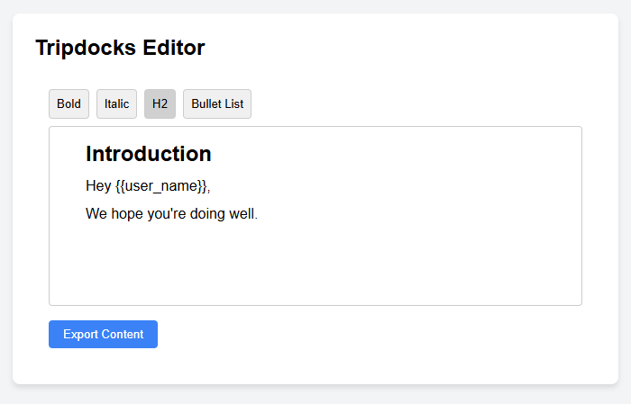
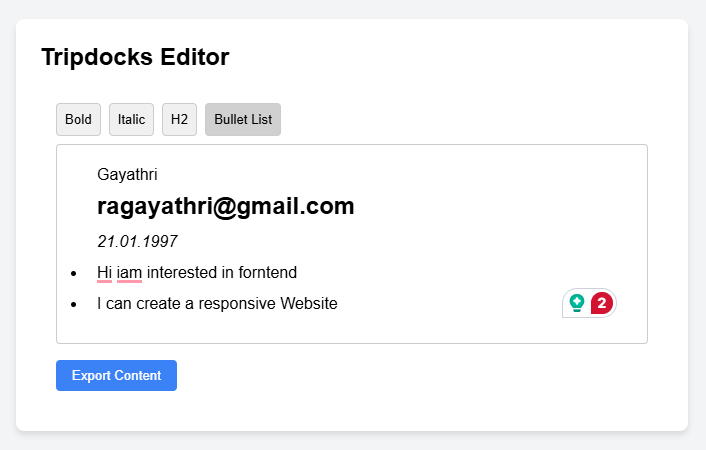
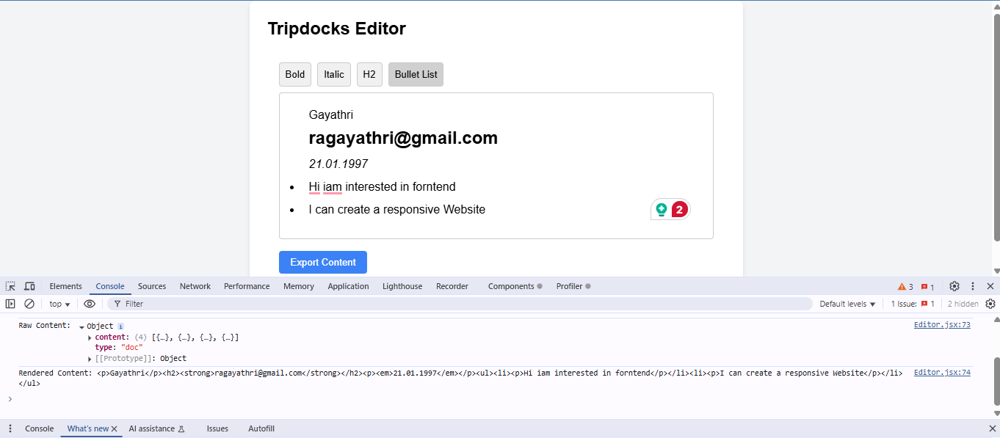

# Rich Text Editor with Variable Insertion

## Setup
1. Clone the repository
2. Run `npm install`
3. Run `npm run dev`

## Features
- Rich text formatting (bold, italic, headings)
- Variable insertion triggered by typing "{{"
- Popover menu for variable selection
- Styled variable tokens with "Change variable" option
- Content export in JSON and HTML formats
- UI matching the provided screenshot

## Usage
1. Type text in the editor
2. Type "{{" to trigger variable suggestions
3. Select a variable from the popover
4. Click a variable token to change it
5. Use toolbar buttons for formatting
6. Click "Export" to see content in console

### Project Structure: Shows the file structure for easy navigation.
tipdocks-editor/
├── src/
│   ├── components/
│   │   ├── Editor.jsx        # Main editor component
│   │   ├── Editor.css        # Styles for the editor
│   │   └── VariableList.jsx  # Popover component for variable selection
│   ├── extensions/
│   │   └── VariableExtension.js  # Custom TipTap extension for variable insertion
│   ├── variables.js          # Predefined variables for insertion
│   ├── App.jsx               # Main app component
│   ├── App.css               # Styles for the app layout
│   ├── index.css             # Global styles
│   ├── main.jsx              # Entry point
│   └── ...
├── index.html
├── package.json
├── vite.config.js
└── README.md
1. **Known Issues**: Documents the Grammarly issue and provides workarounds, as discussed in the previous response.
2. **Responsive Design**: The editor is fully responsive, adapting to various screen sizes (desktop, tablet, mobile) with adjusted padding, font sizes, and layout.
3. **Screenshots**: Includes screenshots.

---

